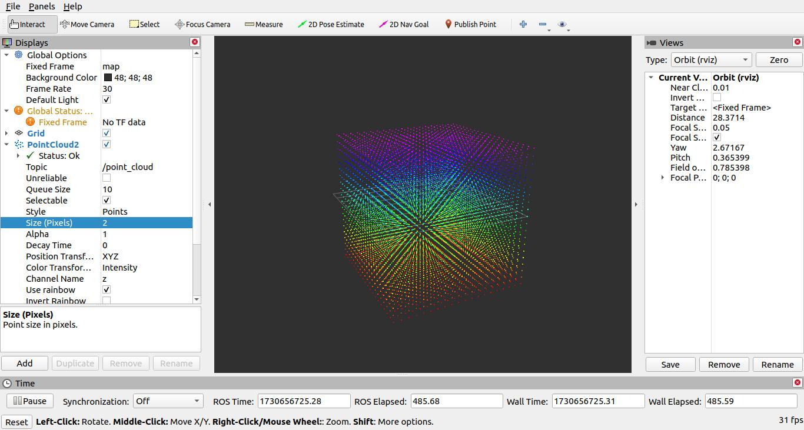
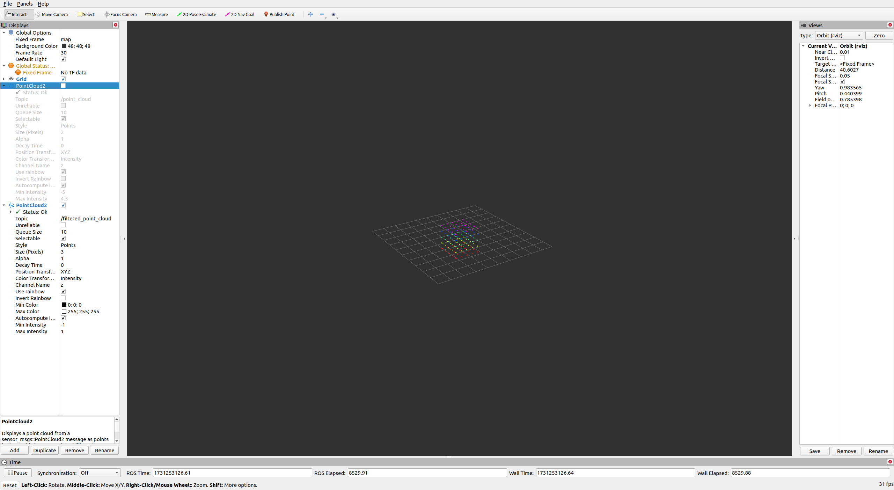

# Visualize_PCL_CropBox_ROS_Rviz

`Visualize_PCL_CropBox_ROS_Rviz` presents an approach For Debugging Transformation (TF) issues when working with `PCL CropBox` in ROS. 

`PCL Cropbox` only keeps the portion of the point cloud which lies inside its bounds. 
If the coordinates and transformation of the Cropbox are incorrect, it can be difficult to correct the issue, especially when working with initial drafts of URDF files from clients and third parties.

In these situations, we ideally want a way to visualize the cropbox itself and use this as the initial point for debugging. 
One Approach to solve this issue is presented below.

## Approach

1. Create a Ros Node which publishes a Cubic Point cloud to fill a section of the 3D Space in Rviz. The script `cubic_point_cloud_publisher.py`.

2. Provide this point cloud message to your ROS node which is using PCL Cropbox.

3. If the section of Rviz contains your Cropbox it should become visible in Rviz. If not adjust the size, location and spacing of the Cube until the Cropbox becomes visible. 

## Cubic_point_cloud_publisher

The `cubic_point_cloud_publisher.py.` publishes Cubic point cloud on the topic `/point_cloud`, which covers a section of the 3D Space in Rviz. Please use the `CUBE_SIZE` and `CUBE_SPACING` variables to change the size and density of the point cloud, respectively.
To change the coordinates of the cube please vary the upper and lower bound on np.arrage used for the calculation x,y and z coordinates, as required.




*NOTE*: Please be careful when changing `CUBE_SIZE` and `CUBE_SPACING` variables, as rendering a large point cloud requires alot of processing power.

## Sample CropBox_Filter

The sample Cropbox Filter is just proivded here for testing purposes. To build the nodes please execute the following command in the base directory of this repo:

```
cd sample_cropbox_filter
```

```
catkin_make
```


*NOTE:* Please make sure to source your ROS distro before executing the above. For example,
```
source /opt/ros/noetic/setup.bash
```

To run the node execute the following commands:

```
source devel/setup.bash
```

```
rosrun sample_pcl_cropbox_filter_node cropbox_filter_node
```



## Supported Platforms

```
    Linux
```
## ROS Version
```
    ROS1
```
*NOTE:* These ROS nodes were tested on ROS NEOTIC but they should be valid for other version of ROS1 which support PointCloud2 msg.